# lgovuk_beautifulsoup
This repo contains Python notebooks used to scrape content from the current www.leeds.gov.uk Leeds City Council web site using the Beautiful Soup Library. The section it uses is anti social behaviour and crime.

## Site structure
The structure below shows the content from the main section page. Note some content also belongs to other sections of the site.

```mermaid
classDiagram
    class antisocial-behaviour-and-crime {
    }
    class environmental-health{
    }
    class children-and-families{
    }
    class plans-and-strategies{

    }
    class housing{
        
    }
    class homeless-or-at-risk{
        
    }
    class support-for-homeless-people {

    }
    class making-a-noise-complaint{
    }
    class report-antisocial-behaviour{

    }
    class report-fly-tipping{

    }
    class domestic-violence-and-abuse{
        
    }
    class help-for-victims-of-domestic-violence-and-abuse{

    }
    class worried-about-your-behaviour-towards-your-partner-or-family{

    }
    class making-a-marac-referral-for-domestic-violence-and-abuse{

    }
    class information-for-practitioners-working-in-domestic-violence-and-abuse{

    }
    class domestic-violence-and-abuse-support-in-safe-accommodation-commissioning-strategy{

    }
    class report-graffiti{

    }
    class report-a-road-that-needs-cleaning{

    }
    class report-a-hate-crime-or-incident{

    }
    class report-discarded-needles-or-drug-related-waste{

    }
    class requesting-cctv{

    }
    class report-antisocial-or-dangerous-driving{

    }
    class public-spaces-protection-orders{

    }
    class report-an-unauthorised-gypsy-or-traveller-site{

    }
    class safer-leeds-partnership{

    }
    class youth-offending-service{

    }
    class keeping-children-safe{

    }
    class support-for-people-at-risk-of-radicalisation-leeds-prevent{

    }
    class help-for-victims-of-modern-slavery{

    }
    class request-an-antisocial-behaviour-case-review{

    }
    antisocial-behaviour-and-crime <-- making-a-noise-complaint
    antisocial-behaviour-and-crime <-- report-antisocial-behaviour
    antisocial-behaviour-and-crime <-- report-fly-tipping
    antisocial-behaviour-and-crime <-- domestic-violence-and-abuse
    domestic-violence-and-abuse <-- help-for-victims-of-domestic-violence-and-abuse
    domestic-violence-and-abuse <-- worried-about-your-behaviour-towards-your-partner-or-family
    domestic-violence-and-abuse <-- making-a-marac-referral-for-domestic-violence-and-abuse
    domestic-violence-and-abuse <-- information-for-practitioners-working-in-domestic-violence-and-abuse
    domestic-violence-and-abuse <-- domestic-violence-and-abuse-support-in-safe-accommodation-commissioning-strategy
    antisocial-behaviour-and-crime <-- report-graffiti
    environmental-health <-- report-a-road-that-needs-cleaning
    antisocial-behaviour-and-crime <-- report-a-road-that-needs-cleaning
    antisocial-behaviour-and-crime <-- report-a-hate-crime-or-incident
    antisocial-behaviour-and-crime <-- report-discarded-needles-or-drug-related-waste
    antisocial-behaviour-and-crime <-- requesting-cctv
    antisocial-behaviour-and-crime <-- report-antisocial-or-dangerous-driving
    antisocial-behaviour-and-crime <-- public-spaces-protection-orders
    antisocial-behaviour-and-crime <-- report-an-unauthorised-gypsy-or-traveller-site
    antisocial-behaviour-and-crime <-- safer-leeds-partnership
    children-and-families <-- keeping-children-safe
    antisocial-behaviour-and-crime <-- youth-offending-service
    keeping-children-safe <-- youth-offending-service
    plans-and-strategies  <-- support-for-people-at-risk-of-radicalisation-leeds-prevent
    antisocial-behaviour-and-crime <-- support-for-people-at-risk-of-radicalisation-leeds-prevent
    housing <-- homeless-or-at-risk
    homeless-or-at-risk <-- support-for-homeless-people
    antisocial-behaviour-and-crime <-- support-for-homeless-people
    antisocial-behaviour-and-crime <-- help-for-victims-of-modern-slavery
    antisocial-behaviour-and-crime <-- request-an-antisocial-behaviour-case-review
```

## The recipes
Each page follows a certain 'recipe' (sorry I am going to totally overdo this analogy). Each recipe contains a set of ingredients.